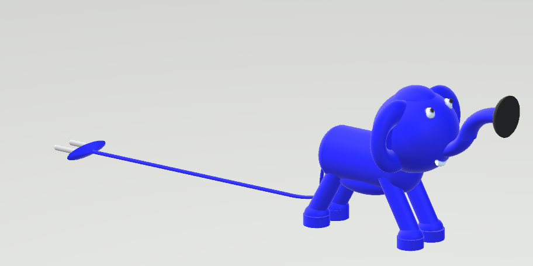
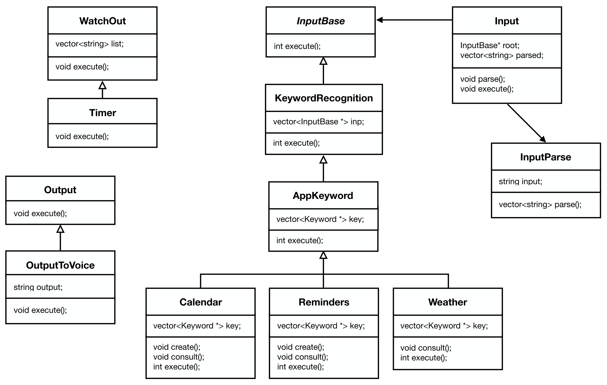

# ELEF

> Authors: Adrien JACQUIER ([@adrien-jk](https://github.com/adrien-jk)), Clément LEMASSON ([@Orelfeu](https://github.com/Orelfeu)), Julien MARTIN-PRIN ([@Flexiboy](https://github.com/Flexiboy)), Léo LAMBERT ([@LeoDPlouc](https://github.com/LeoDPlouc)), Pierre-Victor LANDEZ ([@Tulbius](https://github.com/Tulbius))

## Sommaire / Summary

[Version Française](https://github.com/Elef-PING/Elef#version-française)
* [Description du projet](https://github.com/Elef-PING/Elef#description-du-projet)
* [Cible du projet](https://github.com/Elef-PING/Elef#cible-du-projet)
* [Solution apportée](https://github.com/Elef-PING/Elef#solution-apportée)
* [Visuels](https://github.com/Elef-PING/Elef#visuels)
* [Diagramme UML / OMT Diagram](https://github.com/Elef-PING/Elef#diagramme-uml--omt-diagram)
* [Description des fonctions](https://github.com/Elef-PING/Elef#description-des-fonctions)

[English Version](https://github.com/Elef-PING/Elef#english-version)
* [Project description](https://github.com/Elef-PING/Elef#project-description)
* [Project's target](https://github.com/Elef-PING/Elef#projects-target)
* [Solution brought](https://github.com/Elef-PING/Elef#solution-brought)
* [Visuals](https://github.com/Elef-PING/Elef#visuals)
* [OMT Diagram](https://github.com/Elef-PING/Elef#omt-diagram-1)
* [Function description](https://github.com/Elef-PING/Elef#function-description)

## Version Française

*Ce projet est réalisé dans le cadre du Projet PING (Projet d'ingénieur numérique généraliste) de 3ème année à l'ESILV*

## Description du projet

Elef est un assistant connecté visant à aider les patients atteints de la maladie d'Alzheimer. Pour cela, nous allons d'abord concevoir une enceinte doté d'un assistant vocal. Cet assistant restera limité et l'entrée utilisateur ne se fera que par écrit au travers d'une console dans un premier temps. Notre but est, à termes, de doter cet assistant d'une intelligence artificielle capable de reconnaitre la voix. L'enceinte communiquera cependant par oral avec son utilisateur.

Cet assistant embarquera des fonctions basiques, que l'on attend d'un assistant vocal, comme la gestion d'un calendrier ou des rappels. Mais comme nous nous adressons à des personnes atteintes de la maladie d'Alzheimer, nous allons aussi rappeler certains gestes du quotidien au patient comme le fait de ne pas mettre de métaux au micro-ondes par exemple ou rappeler une date d'anniversaire.

## Cible du projet

La cible de ce projet est les personnes atteintes de la maladie d'Alzheimer, c'est-à-dire une tranche assez agée de la population, n'étant pas forcément à l'aise avec les nouvelles technologies.

## Solution apportée

Comme présenté lors de la description du projet, nous allons concevoir un assistant vocal. Cet assistant communiquera par voie vocal et écrite avec son utilisateur. La voix humaine étant assez compliquée à reconnaître, nous avons choisi de nous contenter d'une entrée utilisateur par voie écrite pour notre prototype. Notre but est bien évidemment, à termes, de nous affranchir de l'interface console et de passer directement par voie orale.

La sortie sera cependant par voie orale car la voix humaine est bien plus simple à synthétiser.

Il faut cependant garder à l'esprit que nous nous adressons à une partie agée de la population n'étant pas forcément à l'aise avec la technologie. Il faudra donc penser à ne pas avoir une approche trop brute avec le patient. Pour cela, nous allons utiliser une voix féminine plutôt douce et nous allons surtout rappeler le fait que c'est une enceinte connectée avant chaque communication.

Pour le côté technique, nous allons utiliser une Raspberry PI 3 (4) ainsi que des haut-parleurs. L'alimentation sera gérée sur secteur et l'enveloppe esthétique de l'enceinte sera conçue par nos soins à l'aide de logiciels de modélisation et d'une imprimante 3D.

## Visuels

## Diagramme UML / OMT Diagram

## Description des fonctions

**InputBase**

Cette classe est l'interface tampon entre l'entrée utilisateur est le programme. Elle fait la liaison entre l'interface de l'input et l'interface de la gestion de cette entrée. Cette classe est composée d'une seule fonction `int execute();` qui renvoie 0 si tout s'est bien déroulé.

**Input**

Cette classe est l'interface gérant l'entrée utilisateur. Elle recoit l'entrée utilisateur et la transmet au parseur qui se charge de séparer les mots pour une meilleure lisibilité au niveau de l'algorithme. Elle est composée de deux fonctions, `void parse();` et `void execute();` qui ne retournent rien toutes les deux.

**InputParse**

C'est la classe qui parse notre entrée utilisateur. Elle prend toute l'entrée utilisateur en entrée et sépare chaque mot pour pouvoir faire une reconnaissance par mots clés. Elle est composée d'une seule méthode `vector<string> parse();` qui se charge de parser notre entrée utilisateur et renvoie un vecteur de chaines de caractères.

**KeywordRecognition**

Cette classe va nous permettre de reconnaitre les mots clés présents dans notre entrée utilisateur. Elle va prendre en entrée `vector<InputBase *> inp;` notre entrée parsée. Cette classe comporte une seule méthode `int execute();` qui retourne 0 si tout s'est bien passé.

**AppKeyword**

Cette classe va nous permettre d'orienter le flux d'instructions en reconnaissant le mot clé lié à l'application que l'on souhaite utiliser (calendrier, rappels, etc...). Cela va nous permettre de faire appel à différentes fonctions qui seront liées à l'application. Elle est composé d'une seule méthode `int execute();` qui renvoie 0 si tout s'est bien passé.

* **Calendar**: C'est la fonction calendrier de notre assistant elle comporte les méthodes `void create();` et `void consult();` qui permettent respectivement de créer un évènement ou de le consulter. La méthode `int execute();` vérifie que tout se passe bien et renvoie 0 si c'est le cas.
* **Reminders**: C'est la fonction qui gère les rappels. Elle agit comme la fonction calendrier
* **Weather**: C'est la fonction qui donne la météo. Elle agit comme la fonction calendrier à l'exception que l'on ne peut pas créer d'évènement.

**Watchout**

Cette classe est la classe gérant les rappels du quotidien. C'est à elle que l'on va faire appel quand il va s'agir de rappeler des gestes simples comme le fait de ne pas mettre de métaux dans le micro-ondes, ou de rappeler des emplacements d'affaires... Elle prend en entrée une liste prédéfinies de rappels qui se trouveront dans un fichier texte. Cette classe ne comporte qu'une seule méthode `void execute();` qui n'est là que pour exécuter la tâche.

**Timer**

Les rappels du quotidiens étants répétés à intervalle régulière, nous avons besoin d'un timer pour pouvoir les annoncer. Cette méthode aide donc à gérer la diffusion des rappels et ne comporte qu'une seule méthode: `void execute();`

**Output**

Cette classe est l'interface qui gère la sortie. Elle va créer une réponse à l'entrée utilisateur ou va créer la requête permettant la diffusion des rappels du quotidien. Elle n'est composée que d'une seule méthode `void execute();`

**OutputToVoice**

Cette méthode va convertir la sortie texte en sortie vocale, ce qui va permettre à l'enceinte de diffuser un son plutôt qu'un texte. Elle n'est composé que d'une seule fonction `void execute();` et prend en entrée la sortie déjà générée.

## English version

*This project is realized as a student project only, through the PING project (Projet d'ingénieur généraliste numérique / Numeric generalist engineering project) in the 3rd year of engineering studies at ESILV*

## Project description

Elef is a connected assistant that helps people suffering from Alzheimer disease. To do that, we will do a speaker with a smart assistant built-in. This assistant will be limited at first and the user's input will be catched through a console. Our long term goal is to get it working only with human voice recognition. The speaker will comunicate with its user only with speaking.

This assistant will have basic features such as a calendar or reminders. But, because our product is designed for Alzheimer suffering people, we will implement some of the basic things to remember like not putting metal stuff inside the microwave or like a birthday.

## Project's target

The target of this project will be people suffering from Alzheimer disease as we mentioned earlier. This is a old branch of the population so we will have to keep that in mind when designing the product.

## Solution brought

As we mentioned earlier, we will build a connected vocal assistant. This assistant will communicate with its user by vocal but also by writing. The user will write an input through a console terminal and the speaker will output a vocal output. The human voice is complicated to recognized and we need a lot of machine learning and artificial intelligence to get it working, so we decided to get the user input only by a console at first. As we mentioned before, our long term goal is to get it working with speaking only. 

The human voice being much easier to sythetise, we decided to get the output by the vocal way.

But we still have to keep in mind that our product has to be designed for old people that are not very confortable with new technologies. We shouldn't have a raw approach with the user. To prevent that, we will use a female voice and we will evocate the type of the object before starting any communication.

## Visuals

## OMT Diagram

## Function description

**InputBase**

This class is the interface between the Input class and the KeywordRecognition class. This class gets the user input and send it to the input class. This class is only composed by a single method: `int execute();`

**Input**

This class is the interface that process the user input. It gets the user input from the InputBase class and send this input to the parser. This class is composed by two methods `void parse();` and `void execute();`

**InputParse**

This is the class that parses the user input. We need to parse the user input for a better processing with the algorithm. This class gets all the user input and splits every word in order to find some keywords. This class is composed by a single method `vector<string> parse();` that return a vector of string.

**KeywordRecognition**

This class will recognize keywords in the parsed input. This will be helpful to redirect the flow into different applications such as the calendar or the reminders. This class is composed of a single method `int execute();` that returns 0 if everything was right.

**AppKeyword**

This class will redirect the flow into all the different apps linked to the keyword we just detected with the KeywordRecognition class. This will help us to call different functions linked to the applications. This class is composed by a single method `int execute();` that returns 0 if everything was right.

* **Calendar**: This is our calendar app. It is composed of the methods `void create();` and `void consult();` which respectively creates or consults an event. It is also composed of the `int execute();` method that returns 0 if eveything was right.
* **Reminders**: This is our reminders app, it is about the same as the calendar app
* **Weather**: This is our weather app, it is about the same as the calendar app except that we cannot create events

**Watchout**

This class is about the basic day things that the user can forget, such as the place where he (or she) left his (or her) socks, or like not putting metal stuff in the microwave. This class is getting a list of things in the input. This class only contains a single method `void execute();` that only execute the task we assigned it.

**Timer**

Our watchouts are timed so we needed a timer function. This is the timer we will use to repeat the watchouts. This class only contains a single method `void execute();` that runs the timer.

**Output**

This class is the interface of the output. It will create the output from the user input or from the Watchout class. This class is composed by a single method `void execute();`.

**OutputToVoice**

This class will convert the output to a voice signal. We will use this class to get a voice instead of a text. It gets the generated output from the Output class and is composed of a single method `void execute();` that runs the programm.
